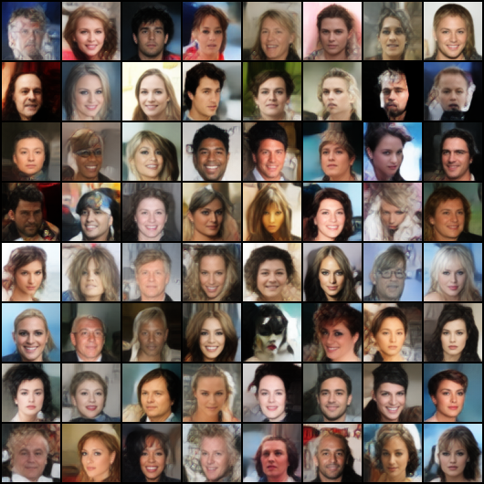
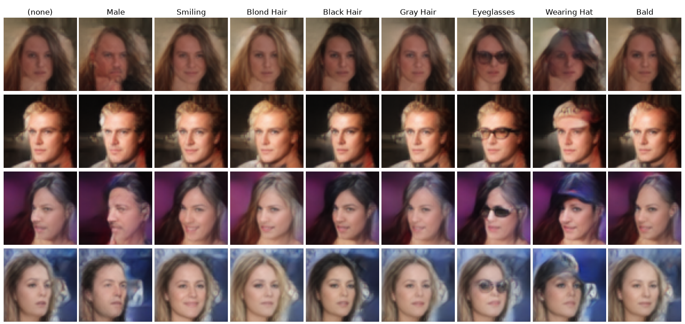
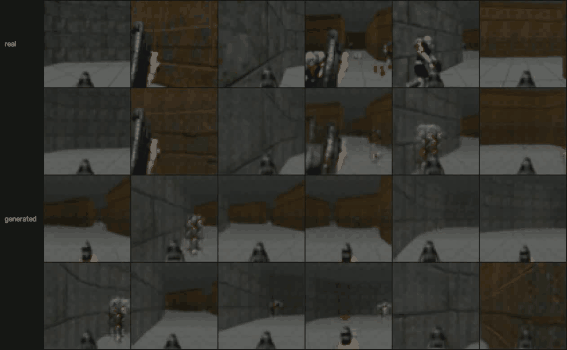
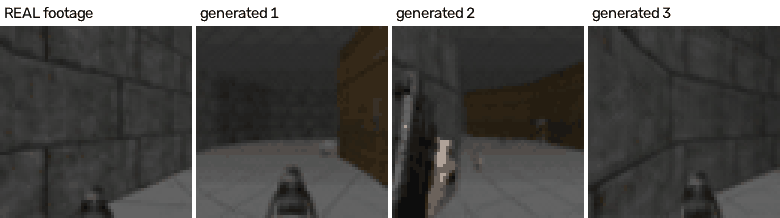
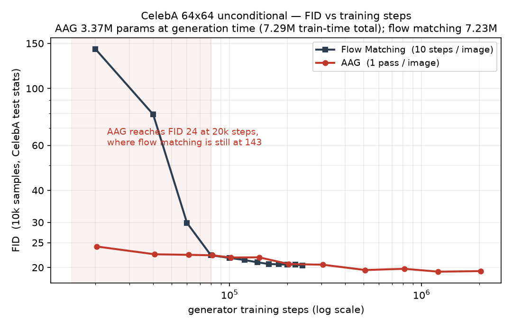
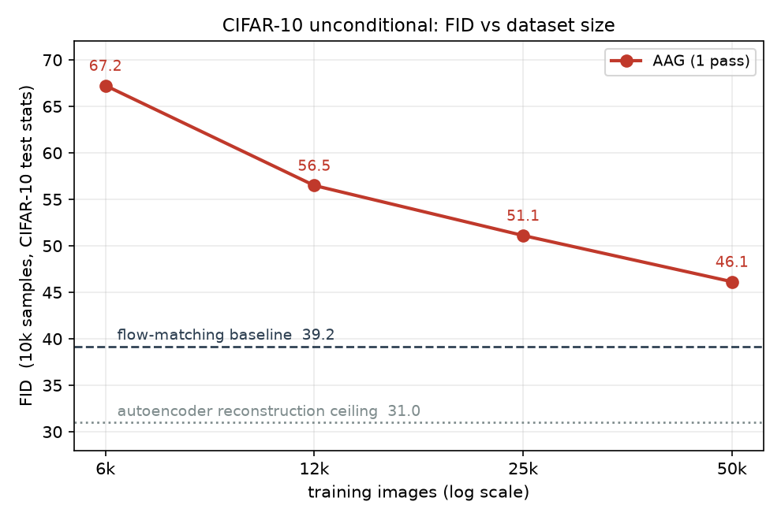

# AAG — Amortised Assignment Generation

Generation in **one forward pass**, with no iterative sampler.

Autoencoder latents are transported once, offline, onto a standard Gaussian.
The transport is a persistent assignment: each training example keeps a fixed
coordinate `z`. A feed-forward network is then trained to map `z` to pixels.
At inference, draw `z ~ N(0,I)` and decode: one pass, no denoising loop, no
autoregression.

---

## Results

### CelebA — unconditional · FID 19.36



### CelebA — conditional on 40 attributes · FID 20.83

Each row holds `z` fixed and toggles one attribute per column. Identity, pose
and background are preserved along a row, i.e. `z` and `c` control disjoint
factors.



### Doom — first-frame-conditioned video · held-out FID 56.89

One frame in, a 16-frame clip out. Top row is real held-out footage; the rest
are generated from fresh `z` on unseen episodes.



### Doom — action-conditioned world model · frame FID 60.18

`(z, 3 previous frames, action)` -> next frame, applied autoregressively: the
model is seeded with 3 real frames and then consumes its own output as context,
with one action held fixed for 60 steps. Top row is real held-out footage; the
rest are rollouts under the Forward action.



The assignment is conditioned on both factors, and the independence ratio is
1.12 against the random-subset floor (per-action mean 1.04). Frame quality does
not imply action control, and the two must be measured separately: with a fresh
`z` the generated frame matches the requested action 15.0% of the time against
a 5.6% chance baseline. The conditioning enters as 18 of 274 input dimensions,
concatenated flat; `z` dominates it.


---

## Comparison with flow matching

Standard flow matching, same data, same FID protocol (10k samples, test-split
reference statistics). AAG samples in one forward pass; flow matching uses 10
Euler steps. Parameter counts are not equal at generation time: 3.37M vs 7.23M
on CelebA, 2.12M vs 4.90M on CIFAR-10. The baseline was sized against AAG's
train-time total (7.29M on CelebA: generator plus autoencoder), but the
autoencoder only builds the assignment and is not used to generate, so the
deployed AAG model is the smaller of the two.

CelebA 64x64:

| generator steps | AAG | flow matching |
|---|---|---|
| 20k | 24.14 | 142.67 |
| 80k | 22.31 | 22.31 |
| 200k | 20.62 | 20.53 |
| best | 19.36 (2.0M steps) | 20.35 (240k steps) |

CIFAR-10 32x32:

| generator steps | AAG | flow matching |
|---|---|---|
| 12.5k | 45.91 | not measured |
| 40k | 45.69 | 114.24 |
| 80k | 46.45 | 39.26 |
| best | 45.91 (12.5k steps) | 39.26 (80k steps) |

AAG converges faster on both datasets and then stops improving. Flow matching
converges slower and continues. On CelebA AAG reaches 19.36; flow matching
plateaus at 20.35. On CIFAR-10 AAG plateaus at ~46 by 40k steps and flow
matching overtakes it between 60k and 80k steps, ending at 39.26.



Curves are from a separate convergence-speed run, not the runs that produced the
sample images above.

### Data scaling on CIFAR-10

Autoencoder, assignment budget and generator recipe fixed; only the number of
training images varies. FID improves by ~5 per doubling and has not flattened at
50k, the full dataset.



Samples per effective dimension does not explain the CelebA/CIFAR-10 gap. At
1,852 samples per intrinsic dimension CelebA reaches 21.7; at 1,690 CIFAR-10
reaches 46.1. CelebA gains nothing from 3.25x more data. See
[`docs/METHOD.md`](docs/METHOD.md) §5.

## How it works

**1. Autoencoder.** Train an AE with MSE + LPIPS. Only the *encoder* matters
downstream — it supplies the latents `h` that get assigned.

**2. Assignment.** Whiten `h`, then repeatedly pick a direction, sort the
projections, and rank-match them to Gaussian order statistics. Rank matching is
exact optimal transport in 1D, and iterating over directions converges to the
target. The result is a fixed pairing `(x_i, z_i)`.

For conditional generation the assignment must also satisfy `z ⊥ c`, otherwise
drawing `z` independently and pairing it with a chosen `c` is invalid. That is
enforced by additionally transporting *conditional neighbourhoods* — exact groups
for categorical conditions, k-NN for continuous ones.

**3. Generator.** Train `G: z (⊕ c) → pixels` directly, with MSE + LPIPS. Decoding
through a frozen AE decoder instead is measurably worse (FID 23.83 vs 20.95 at
matched budget): the decoder is brittle to off-manifold inputs.

---

## Setup

```bash
python -m venv .venv && source .venv/bin/activate
pip install torch torchvision lpips numpy scipy matplotlib opencv-python pillow
pip install -e .
```

## Reproducing

Each headline experiment is one script:

```bash
experiments/celeba_uncond.sh       # FID 19.36
experiments/celeba_cond.sh         # FID 20.83
experiments/cifar10_uncond.sh      # FID 45.91
experiments/cifar10_cond.sh
experiments/doom_worldmodel.sh     # (z, 3 frames, action) -> next frame
experiments/doom_video.sh          # held-out FID 56.89
```

Doom needs the [p-doom/doom-dataset](https://huggingface.co/datasets/p-doom/doom-dataset)
(10M frames, CC0); `scripts/preprocess_doom.py` converts it to the segment cache
the loaders expect.

## Checkpoints and curves

The exact weights behind every number above are in [`weights/`](weights/)
(~200 MB total, see its README for the manifest). Per-experiment assignment
diagnostics and training curves are in [`assets/curves/`](assets/curves/):
`<experiment>_assignment.png` is the standard six-panel assignment view,
`<experiment>_training.png` shows AE and generator training with FID where it
was measured.

## Layout

    aag/            the library: ae · gaussianize · diagnostics · datasets · video · fid
    scripts/        entry points (training, assignment, evaluation, rendering)
    experiments/    one runnable recipe per headline experiment
    weights/        released checkpoints for the headline models
    plots/          standard figures: assignment / ae / generations
    docs/           METHOD.md — method, theory, metrics, scaling laws
    assets/         images used in this README, curves in assets/curves/

