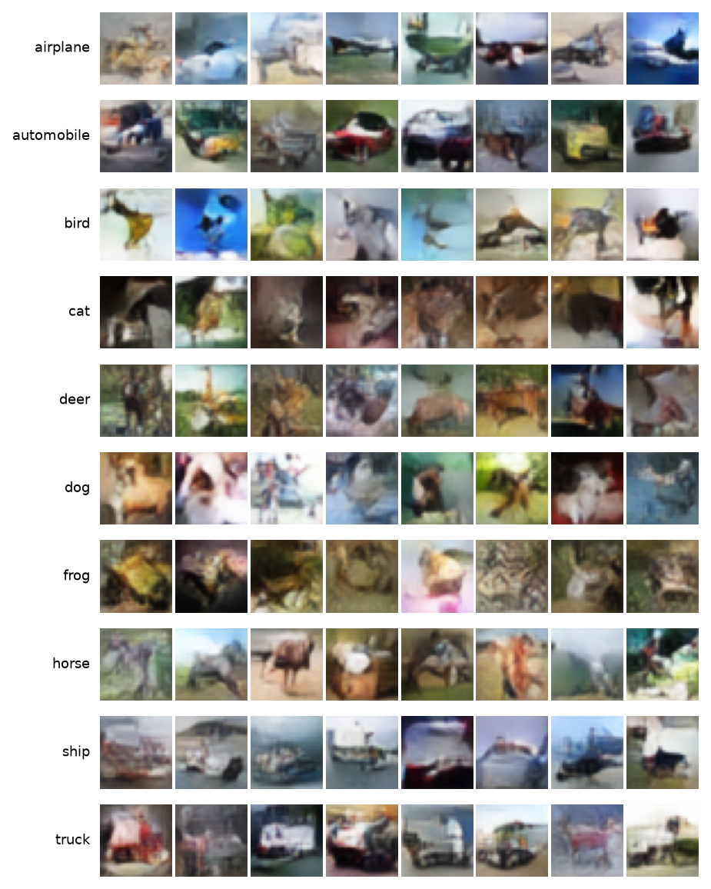
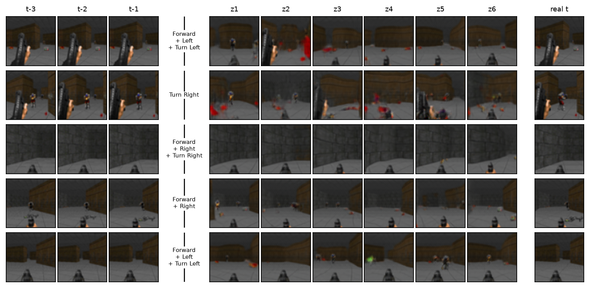

# AAG — Amortised Assignment Generation

Generation in **one forward pass**, with no iterative sampler.

Autoencoder latents are transported once, offline, onto a standard Gaussian. That
transport is a *persistent assignment*: every training example keeps a fixed
Gaussian coordinate `z`. A single feed-forward network is then trained to map that
coordinate straight to pixels. At inference you draw `z ~ N(0,I)` and decode —
one pass, no denoising loop, no autoregression.

---

## Results

### CelebA — unconditional · FID 19.36


### CelebA — conditional on 40 attributes · FID 20.83

Each row holds `z` fixed and toggles one attribute per column. Identity, pose and
background persist along a row while the attribute changes — `z` and the
condition control separate things, which is what the conditional transport buys.


### CIFAR-10 — conditional on class

Each row is one class (labelled), each column a fresh `z`.



### Doom — action-conditioned world model

Predicts the next frame from the three preceding frames plus the agent's action.
Each row: the three context frames, the action taken, six alternative
continuations from different `z`, and the real next frame — on episodes the
model never saw. The scene is pinned by the context; `z` decides the uncertain
content, and several draws land close to what actually happened.



### Doom — first-frame-conditioned video · held-out FID 60.10

Give it one frame; it generates a 16-frame clip. Top row is **real** held-out
footage for reference, the rest are generated from fresh `z` on episodes the model
never saw.


---

## How it works

**1. Autoencoder.** Train an AE with MSE + LPIPS. Only the *encoder* matters
downstream — it supplies the latents `h` that get assigned.

**2. Assignment.** Whiten `h`, then repeatedly pick a direction, sort the
projections, and rank-match them to Gaussian order statistics. Rank matching is
exact optimal transport in 1D, and iterating over directions converges to the
target. The result is a fixed pairing `(x_i, z_i)`.

For conditional generation the assignment must also satisfy `z ⊥ c`, otherwise
drawing `z` independently and pairing it with a chosen `c` is invalid. That is
enforced by additionally transporting *conditional neighbourhoods* — exact groups
for categorical conditions, k-NN for continuous ones.

**3. Generator.** Train `G: z (⊕ c) → pixels` directly, with MSE + LPIPS. Decoding
through a frozen AE decoder instead is measurably worse (FID 23.83 vs 20.95 at
matched budget): the decoder is brittle to off-manifold inputs.

---

## Setup

```bash
python -m venv .venv && source .venv/bin/activate
pip install torch torchvision lpips numpy scipy matplotlib opencv-python pillow
pip install -e .
```

## Reproducing

Each headline experiment is one script:

```bash
experiments/celeba_uncond.sh       # FID 19.36
experiments/celeba_cond.sh         # FID 20.83
experiments/cifar10_cond.sh
experiments/doom_worldmodel.sh
experiments/doom_video.sh          # held-out FID 60.10
```

Doom needs the [p-doom/doom-dataset](https://huggingface.co/datasets/p-doom/doom-dataset)
(10M frames, CC0); `scripts/preprocess_doom.py` converts it to the segment cache
the loaders expect.

## Checkpoints and curves

The exact weights behind every number above are in [`weights/`](weights/)
(~200 MB total, see its README for the manifest). Per-experiment assignment
diagnostics and training curves are in [`assets/curves/`](assets/curves/):
`<experiment>_assignment.png` is the standard six-panel assignment view,
`<experiment>_training.png` shows AE and generator training with FID where it
was measured.

## Layout

    aag/            the library: ae · gaussianize · diagnostics · datasets · video · fid
    scripts/        entry points (training, assignment, evaluation, rendering)
    experiments/    one runnable recipe per headline experiment
    weights/        released checkpoints for the headline models
    plots/          standard figures: assignment / ae / generations
    docs/           METHOD.md — method, theory, metrics, scaling laws
    assets/         images used in this README, curves in assets/curves/

## Diagnostics

`docs/METHOD.md` covers the method, why it is valid, the G/I/R metrics, and the
measured scaling behaviour. Short version, from measurement rather than
intuition:

- **G** (Gaussianity) and **I** (independence ratio) have predicted the better
  assignment every time we had held-out FID to check against.
- **Local-geometry metrics** (displacement, kNN preservation, local decodability
  `R`) describe what transport does but have repeatedly *mis*-ranked assignments.
  An assignment with badly scrambled local structure produced our best video model.
- **Training loss does not rank assignments.** It rewards whichever one is easiest
  to fit, which is the one that transported least.

Dead ends are recorded there too, so they are not re-tried.
